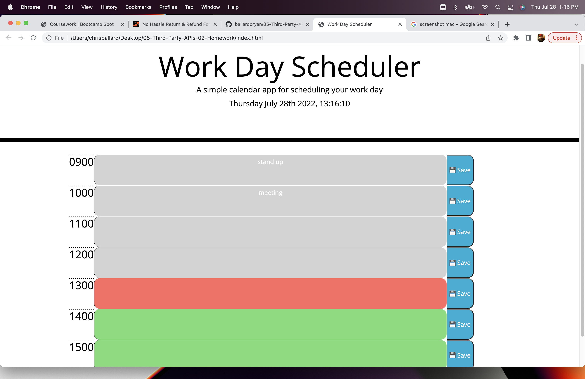

# Day Planner

## Description

This application serves as a simple planner with which to organize the user's daily activities. It is broken into (8) one-hour time blocks representing the eight hours of the typical work day. Each time block contains a text field in which the user can input tasks or activities which can then be saved to local storage

## Table of Contents

- [Installation](#installation)
- [Usage](#usage)
- [Credits](#credits)
- [License](#license)
- [Tests](#tests)
- [Questions](#questions)

## Installation

This application is deployed to github pages at the URL: 

## Usage

On page load, the user is presented with empty time blocks in which they may add tasks or activities. When the user clicks the save button, the entries are save to local storage so that they persist beyond page refresh. Additionally, the time blocks are color coded to indicate whether they are in the past present or future. Past time blocks are grey, future time blocks are green, and the current time block is red.

## Credits

This application was developed by Chris Ballard.

## License

This application utilizes the Apache 2.0 license. Click on the badge above for more information.

## Tests

No application tests have been provided at this time.

## Questions

Github username: ballardcryan

Github URL: https://github.com/ballardcryan

Email: ballardcryan@gmail.com

